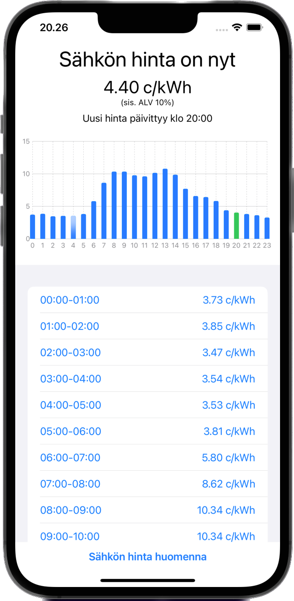

# spot-seuranta

This repository holds the source code for a Swift app which can be used to track Finland's electricity spot prices for 'today' and 'tomorrow'. The data is 
fetched from [ENTSO-E](https://transparency.entsoe.eu/) using their RESTful API, and asynchronously fetched in XML-format, parsed, and then displayed in 
the SwiftUI. The main language in the app at the moment is only Finnish.

