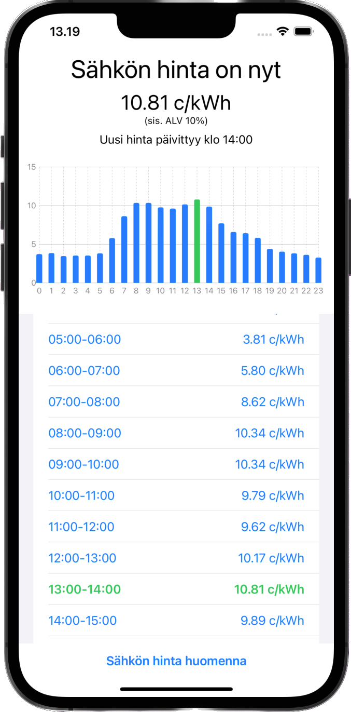
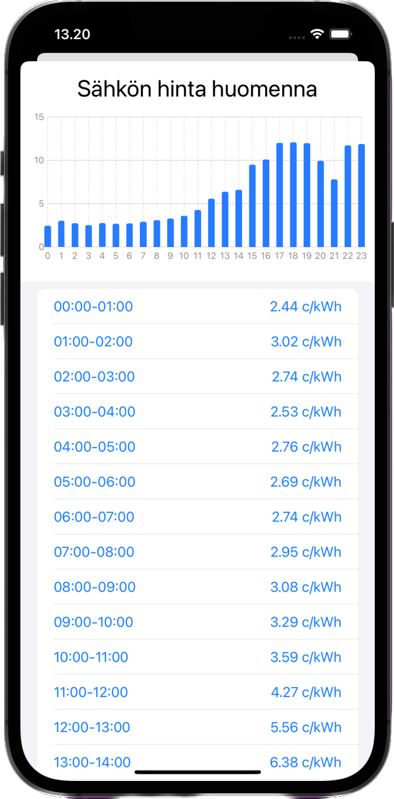

# :electric_plug: spot-seuranta

This repository holds the source code for a Swift app which can be used to track Finland's electricity spot prices for 'today' and 'tomorrow'. The data is 
asynchronously fetched from [ENTSO-E](https://transparency.entsoe.eu/) in XML-format, using their RESTful API, parsed, and then displayed in 
the SwiftUI. The main language in the app at the moment is only Finnish. 

## :question: How to use 

In order to use the app you must submit a ticket to ENTSO-E to receive your own security token (API key). After obtaining the key, the program can be used after placing the key in an `entso.plist` file in the project directory.

The file's contents should be as follows, replacing the string value with your own security token:
```xml
<?xml version="1.0" encoding="UTF-8"?>
<!DOCTYPE plist PUBLIC "-//Apple//DTD PLIST 1.0//EN" "http://www.apple.com/DTDs/PropertyList-1.0.dtd">
<plist version="1.0">
<dict>
	<key>API_KEY</key>
	<string>your security token here</string>
</dict>
</plist>
```

After previous steps are completed, the program can be compiled and ran through Xcode or locally through a personal device.

<hr>

<p float="left">
	
	
</p>
